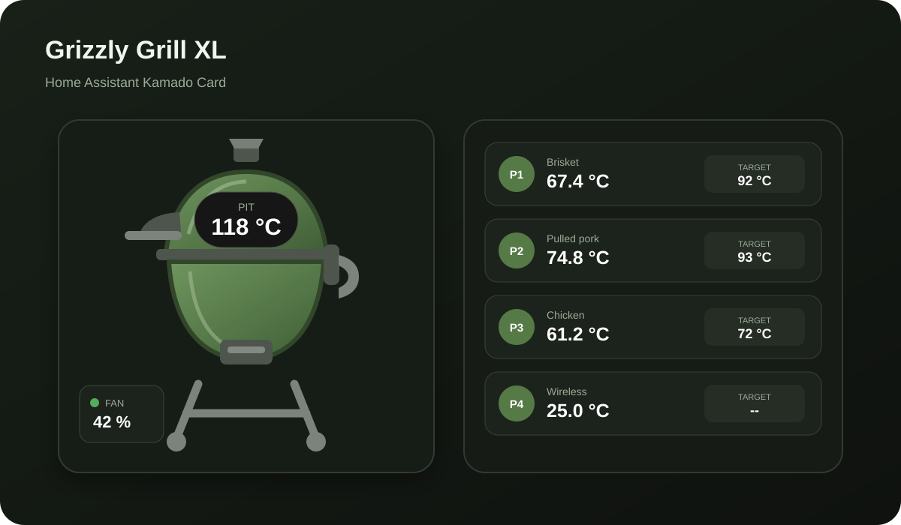

# Kamado Card for Home Assistant

A self-contained Home Assistant dashboard card for kamado BBQs. It combines a responsive SVG kamado with a fixed pit/fan layout and up to four freely assignable temperature probe slots.

The card works with normal Home Assistant entities and is not tied to a specific BBQ integration. It pairs naturally with [bjedelijn/ha-inkbird-bbq](https://github.com/bjedelijn/ha-inkbird-bbq).



## Features

- inline SVG kamado with no external image assets;
- configurable kamado color;
- fixed pit-temperature display;
- fixed fan-output display and optional fan on/off control;
- optional pit target with inline +/- buttons for `number` entities;
- up to four freely assignable probe slots;
- optional target per probe;
- target-aware status colors: orange when close, green when reached, and pit over-temperature warning;
- responsive desktop/tablet/mobile layout;
- built-in Home Assistant visual card configuration form;
- HACS-compatible `dist/ha-kamado-card.js` package.

## Installation with HACS

Until the card is in the default HACS store:

1. Open **HACS**.
2. Open the menu and choose **Custom repositories**.
3. Add `https://github.com/bjedelijn/ha-kamado-card`.
4. Select category **Dashboard**.
5. Download **Kamado Card**.
6. Refresh the Home Assistant frontend.

HACS should register the JavaScript resource automatically. If needed, add this manually under **Settings -> Dashboards -> Resources**:

```text
/hacsfiles/ha-kamado-card/ha-kamado-card.js
```

Resource type: **JavaScript Module**.

## Minimal configuration

```yaml
type: custom:ha-kamado-card
title: Kamado
kamado_color: "#557a46"
pit_entity: sensor.kamado_pit_temperature
fan_entity: sensor.kamado_fan_output
```

## Grizzly Grill XL example

The first reference setup is a Grizzly Grill XL with an INKBIRD ISC-027BW controller.

```yaml
type: custom:ha-kamado-card
title: Grizzly Grill XL
kamado_color: "#557a46"

pit_entity: sensor.inkbird_isc_027bw_pit_temperature
pit_target_entity: number.inkbird_isc_027bw_set_pit_target_experimental
fan_entity: sensor.inkbird_isc_027bw_fan_output
fan_switch_entity: switch.inkbird_isc_027bw_fan_control_experimental

probe_1_name: Meat 1
probe_1_entity: sensor.inkbird_isc_027bw_meat_probe_1
probe_1_target_entity: number.inkbird_isc_027bw_set_meat_probe_1_alarm_experimental

probe_2_name: Meat 2
probe_2_entity: sensor.inkbird_isc_027bw_meat_probe_2
probe_2_target_entity: number.inkbird_isc_027bw_set_meat_probe_2_alarm_experimental

probe_3_name: Meat 3
probe_3_entity: sensor.inkbird_isc_027bw_meat_probe_3
probe_3_target_entity: number.inkbird_isc_027bw_set_meat_probe_3_alarm_experimental
```

A fourth slot can point to any other temperature entity, for example a wireless INT-14-BW probe.

## Configuration options

| Option | Required | Description |
| --- | --- | --- |
| `title` | No | Card title. Default: `Kamado`. |
| `kamado_color` | No | Any valid CSS color. |
| `pit_entity` | No | Current pit/grill temperature. |
| `pit_target_entity` | No | Pit target sensor or `number` entity. |
| `fan_entity` | No | Fan output entity, usually a percentage sensor. |
| `fan_switch_entity` | No | Optional switch used to enable/disable fan control. |
| `probe_1_entity` ... `probe_4_entity` | No | Current temperature for each probe slot. |
| `probe_1_target_entity` ... `probe_4_target_entity` | No | Optional target for each probe. |
| `probe_1_name` ... `probe_4_name` | No | Friendly label for each probe slot. |

When a target is a Home Assistant `number` entity, the card shows **- / +** controls and respects its `min`, `max` and `step` values.

Temperature status is calculated automatically when both a current-temperature entity and target entity contain numeric values. Meat probes turn **orange** when they are close to target and **green** when the target is reached. The pit display turns **green** while it is in the target band and **red** when it is clearly above target. Thresholds are unit-aware for Celsius and Fahrenheit.

## Design philosophy

Pit and fan positions are fixed because they belong to the kamado/controller. Probe slots are independent, so they can point to an ISC-027BW wired probe, INT-14-BW wireless probe, TNT-11-B or any other Home Assistant temperature entity.

## Development

```bash
npm run build
npm run check
```

Source lives in `src/ha-kamado-card.js`. The HACS distribution file lives in `dist/ha-kamado-card.js`.

## Releases

Version tags use the form `v0.1.0`. Pushing a `v*` tag validates the distribution file and creates a GitHub Release.

## License

MIT
